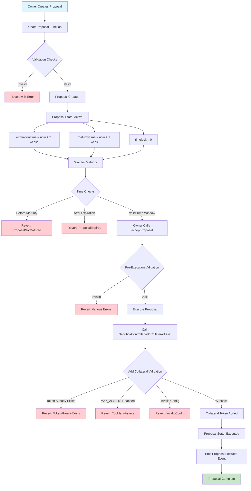

# New Collateral Token Proposal Flow

## Overview
This diagram shows the complete flow for proposing and accepting a new collateral token in the ConfigController system.

## Flow Diagram

## Detailed Steps

### 1. Proposal Creation
- **Function**: `createProposal2(calldata, cometAddress, proposalType)`
- **Caller**: Owner only
- **Validation**: 
  - Only owner can create proposals
  - Valid comet address
  - Valid proposal type

### 2. Proposal State
- **Status**: Active
- **Timeline**:
  - `maturityTime`: Current time + 1 week (can't execute before)
  - `expirationTime`: Current time + 2 weeks (can't execute after)
  - `timelock`: 0 (no additional delay)

### 3. Proposal Acceptance
- **Function**: `acceptProposal(proposalId)`
- **Caller**: Owner only
- **Validation**:
  - Proposal exists and is active
  - Current time >= maturityTime
  - Current time <= expirationTime
  - Timelock period passed

### 4. Execution
- **Target**: SandboxController.addCollateralAsset()
- **Parameters**: CollateralTokenConfigStruct
- **Validation**:
  - Token not already added
  - Under MAX_ASSETS limit (24)
  - Valid configuration parameters

### 5. Success
- Collateral token added to comet
- Proposal marked as executed
- Event emitted

## Error Handling

### Common Revert Reasons:
1. **NoActiveProposal**: Proposal doesn't exist
2. **ProposalExpired**: Past expiration time
3. **ProposalNotMatured**: Before maturity time
4. **TokenAlreadyExists**: Token already in comet
5. **TooManyAssets**: MAX_ASSETS limit reached
6. **InvalidConfig**: Invalid configuration parameters

## Gas Optimization

### Key Considerations:
- **Library Usage**: Constants stored in libraries for reuse
- **Batch Operations**: Multiple proposals can be created efficiently
- **State Management**: Proper cleanup after execution
- **Event Optimization**: Minimal event data for gas efficiency

## Security Features

### Access Control:
- Only owner can create/accept proposals
- Time-based restrictions prevent immediate execution
- Validation at multiple levels

### Validation Layers:
1. **Proposal Level**: Time and state validation
2. **Execution Level**: Business logic validation
3. **Contract Level**: Solidity safety checks 